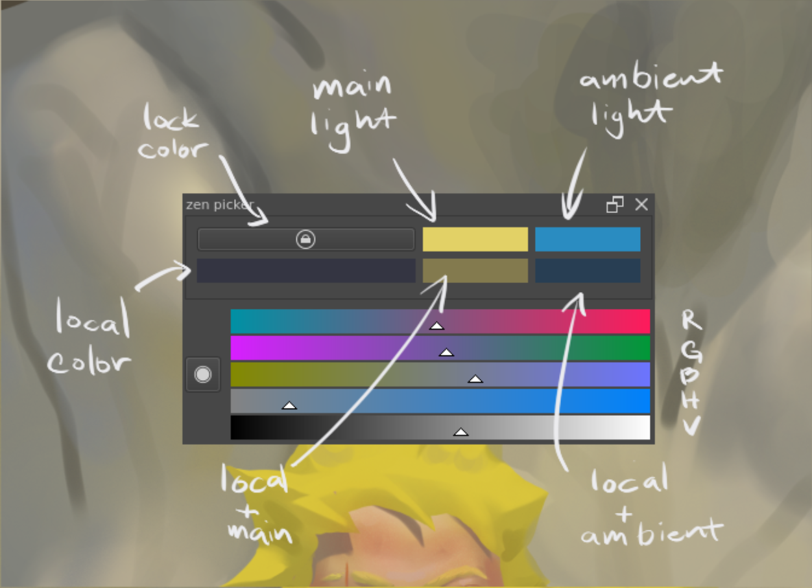

# zen picker (WIP)

This is a custom color picker [Krita](https://krita.org/) plugin. The main goal
for this color picker is to add the ability to easily control saturation and
value for RGB sliders. Secondary goal is to get light and shadow color based on
the main light and the ambient light.

## controls
- main/ambient light
    - change color: ctrl + click
    - pick color: click
- local/main_mix/ambient_mix
    - pick color: click
- sliders
    - click + drag

## install

i wanted to use [rust](https://www.rust-lang.org/) for part of the project for
fun. so there's some extra stuff to do to get it working. (until i figure out
how i can prebuild it for major platforms)

- [install rust](https://www.rust-lang.org/tools/install)
- `cargo install just`
- [download project zip](https://github.com/l0l-studio/zen_picker/archive/refs/heads/main.zip)
- unzip the project
- open project directory `zen_picker-main`, where you can find the `.py` files
- open it in the terminal
- run
    - linux: `just distribute`
    - windows: `just --shell powershell.exe --shell-arg -c distribute_win`
- [install plugin manually](https://docs.krita.org/en/user_manual/python_scripting/install_custom_python_plugin.html#manually)
    - in krita, go to: settings > manage resources > open resource folder
    - open the `pykrita` folder
    - copy the `zen_picker.desktop` file into `pykrita`
    - copy the whole `zen_picker-main` folder into `pykrita` and rename it to `zen_picker`

restart krita, zen_picker should be in settings > dockers > zen_picker
